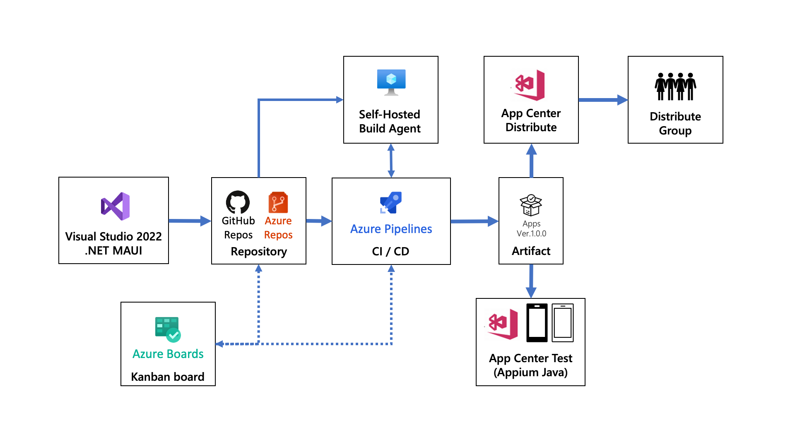

# Demo for .NET MAUI, Azure DevOps, and App Center

This repo is the demo for .NET MAU, Azure DevOps, and App Center.

## Architecture

## Technology stack

* .NET 6
* .NET MAUI
* Visual Studio 2022
* Visual Studio App Center
* Azure Pipelines
* Appium (Java)

## Preparation

* Azure DevOps
  - [Azure DevOps Services | Microsoft Azure](https://azure.microsoft.com/ja-jp/services/devops/)
* Visual Studio App Center
  - [Visual Studio App Center | iOS, Android, Xamarin & React Native](https://appcenter.ms/)

* .NET MAUI Development environment (Android)
  - [Visual Studio 2022 Preview](https://visualstudio.microsoft.com/ja/vs/preview/)
    - Select all of the Desktop and Mobile workloads and Azure Development workload.
  - Android Emulator
    - [How to enable hardware acceleration with Android emulators (Hyper-V & HAXM) - .NET MAUI | Microsoft Docs](https://docs.microsoft.com/dotnet/maui/android/emulator/hardware-acceleration)
    - [Managing virtual devices with the Android Device Manager - .NET MAUI | Microsoft Docs](https://docs.microsoft.com/dotnet/maui/android/emulator/device-manager)
    - [Build your first app - .NET MAUI | Microsoft Docs](https://docs.microsoft.com/dotnet/maui/get-started/first-app)
  - Appium
    - `npm install –g appium` or install `Appium Desktop`
      - [appium/getting-started.md at master · appium/appium · GitHub](https://github.com/appium/appium/blob/master/docs/en/about-appium/getting-started.md)
  - Maven
    - Apache Maven Install: [https://maven.apache.org](https://maven.apache.org)
  - App Center CLI
    - App Center CLI Install: [Run Included Tests with App Center - Visual Studio App Center | Microsoft Docs](https://docs.microsoft.com/en-us/appcenter/quickstarts/android/test)

## Contributing

This project has adopted the [Microsoft Open Source Code of Conduct](https://opensource.microsoft.com/codeofconduct/). For more information see the [Code of Conduct FAQ](https://opensource.microsoft.com/codeofconduct/faq/) or contact [opencode@microsoft.com](mailto:opencode@microsoft.com) with any additional questions or comments.
